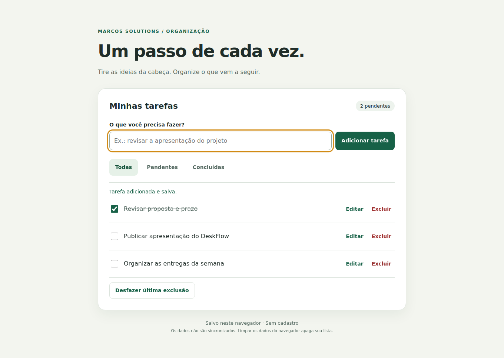
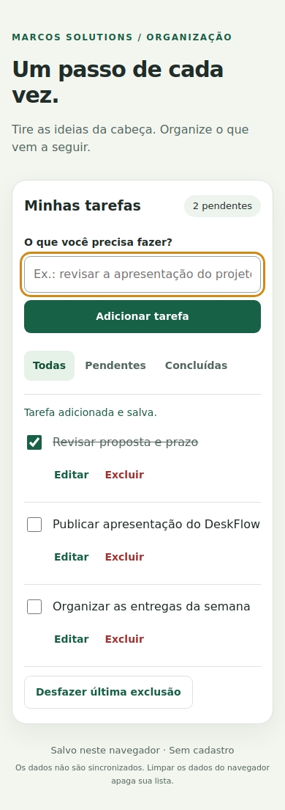

# Task List

A focused task manager built with **HTML, CSS and vanilla JavaScript**. Add a task, mark it complete and pick up where you left off after a page refresh.



## Features

- Create, edit, complete and delete tasks.
- Filter all, pending or completed tasks.
- Undo the most recent deletion during the current session.
- Persist tasks in the browser with `localStorage`.
- Keyboard submission, explicit form labels, focus indicators and status announcements.
- Responsive layout without external fonts or runtime dependencies.

## Run locally

Clone the repository and serve its root with VS Code Live Server, or use Python:

```bash
git clone https://github.com/Santoszoi/listadetarefa2.git
cd listadetarefa2
python -m http.server 8000
```

Open **http://localhost:8000**. Use the same address and port when returning to your saved list. The interface is in Brazilian Portuguese.

## Technical decisions

**Vanilla JavaScript:** a small application can demonstrate DOM events, state updates and browser persistence without a framework or build step.

**Safe text rendering:** task content is inserted using `textContent`, including records restored from storage. User input is never interpolated into HTML. Titles accept 1–160 characters instead of silently truncating input.

**Save before updating the interface:** state changes are applied only after storage succeeds. Invalid saved data is preserved rather than overwritten. Visible messages explain storage failures.

**Local persistence:** no backend, account, analytics or synchronization. Records stay in this browser and origin. Clearing browser data deletes the list. Multiple tabs do not merge concurrent edits; use one tab. This is not a secure vault for sensitive information.

**Undo:** only the last deleted task is retained in memory; refreshing the page clears undo history.

## Browser checks

Requires Node.js and npm for tests only:

```bash
npm ci
npx playwright install chromium
npm test
```

The browser test starts its own local server and checks creation, editing, completion, filters, deletion/undo, persistence after reload, HTML-injection handling, storage failures, corrupted data protection and mobile horizontal overflow. It also captures the screenshots shown here. No complete accessibility audit is claimed.

<details>
<summary>Mobile screenshot</summary>



</details>

## Project history

This repository began as a small DOM exercise. The revision adds persistence, safer rendering, completion filters, undo, responsive styling and browser checks while keeping the code approachable. It complements the full-stack [DeskFlow](https://github.com/Santoszoi/deskflow-help-desk) project.

**Marcos Neves** · [Portfolio](https://marcossolutions.com.br)
